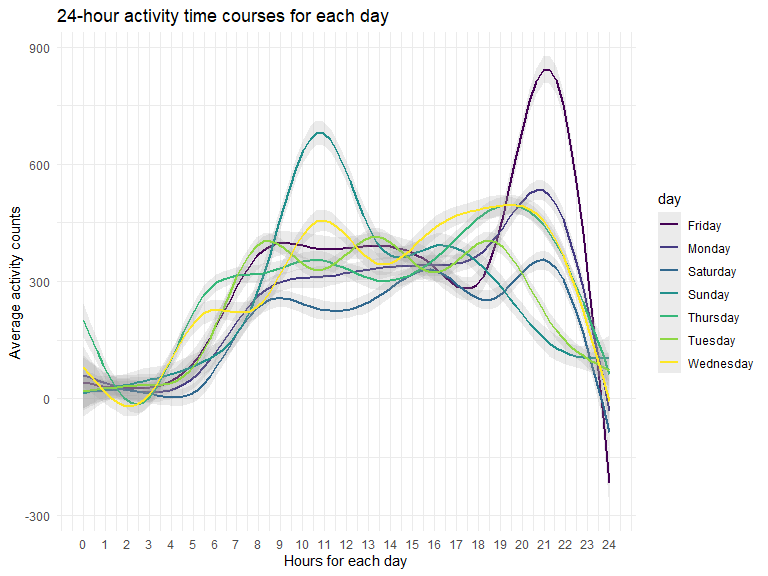
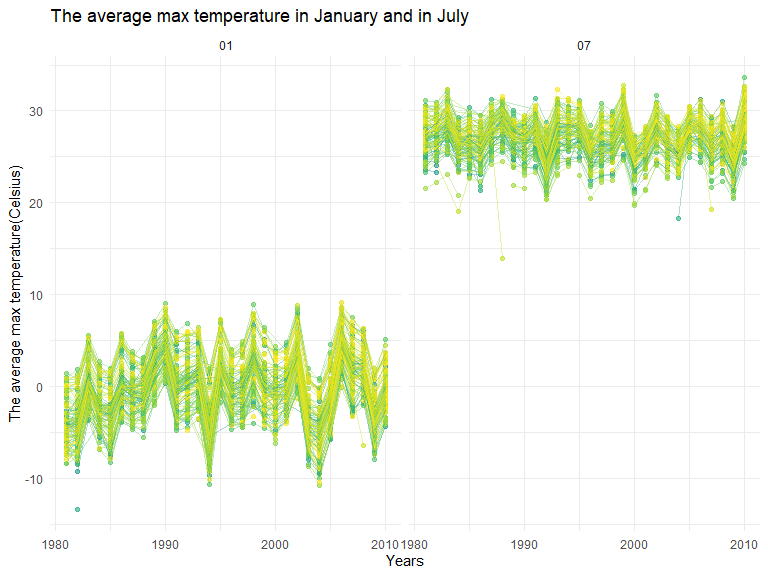
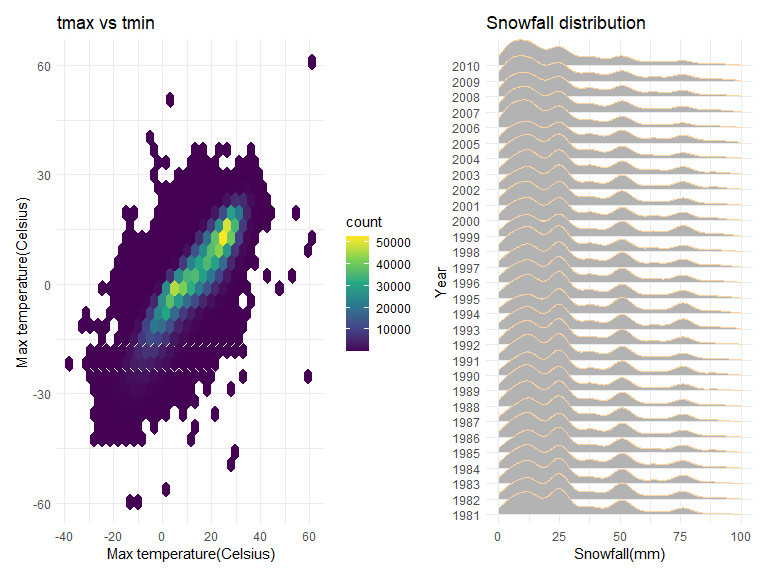

p8105_hw3
================
qz2492
2022-10-11

### Problem 1

#### Read in the data

``` r
data("instacart")

instacart = 
  instacart %>% 
  as_tibble(instacart)
```

#### Answer questions about the data

This dataset contains 1384617 rows and 15 columns, with each row
resprenting a single product from an instacart order. Variables include
identifiers for user, order, and product; the order in which each
product was added to the cart. There are several order-level variables,
describing the day and time of the order, and number of days since prior
order. Then there are several item-specific variables, describing the
product name (e.g. Yogurt, Avocado), department (e.g. dairy and eggs,
produce), and aisle (e.g. yogurt, fresh fruits), and whether the item
has been ordered by this user in the past. In total, there are 39123
products found in 131209 orders from 131209 distinct users.

Below is a table summarizing the number of items ordered from aisle. In
total, there are 134 aisles, with fresh vegetables and fresh fruits
holding the most items ordered by far.

``` r
instacart %>% 
  count(aisle) %>% 
  arrange(desc(n))
```

    ## # A tibble: 134 × 2
    ##    aisle                              n
    ##    <chr>                          <int>
    ##  1 fresh vegetables              150609
    ##  2 fresh fruits                  150473
    ##  3 packaged vegetables fruits     78493
    ##  4 yogurt                         55240
    ##  5 packaged cheese                41699
    ##  6 water seltzer sparkling water  36617
    ##  7 milk                           32644
    ##  8 chips pretzels                 31269
    ##  9 soy lactosefree                26240
    ## 10 bread                          23635
    ## # … with 124 more rows

Next is a plot that shows the number of items ordered in each aisle.
Here, aisles are ordered by ascending number of items.

``` r
instacart %>% 
  count(aisle) %>% 
  filter(n > 10000) %>% 
  mutate(aisle = fct_reorder(aisle, n)) %>% 
  ggplot(aes(x = aisle, y = n)) + 
  geom_point() + 
  labs(title = "Number of items ordered in each aisle") +
  theme(axis.text.x = element_text(angle = 60, hjust = 1))
```


Our next table shows the three most popular items in aisles
`baking ingredients`, `dog food care`, and `packaged vegetables fruits`,
and includes the number of times each item is ordered in your table.

``` r
instacart %>% 
  filter(aisle %in% c("baking ingredients", "dog food care", "packaged vegetables fruits")) %>%
  group_by(aisle) %>% 
  count(product_name) %>% 
  mutate(rank = min_rank(desc(n))) %>% 
  filter(rank < 4) %>% 
  arrange(desc(n)) %>%
  knitr::kable()
```

| aisle                      | product_name                                  |    n | rank |
|:---------------------------|:----------------------------------------------|-----:|-----:|
| packaged vegetables fruits | Organic Baby Spinach                          | 9784 |    1 |
| packaged vegetables fruits | Organic Raspberries                           | 5546 |    2 |
| packaged vegetables fruits | Organic Blueberries                           | 4966 |    3 |
| baking ingredients         | Light Brown Sugar                             |  499 |    1 |
| baking ingredients         | Pure Baking Soda                              |  387 |    2 |
| baking ingredients         | Cane Sugar                                    |  336 |    3 |
| dog food care              | Snack Sticks Chicken & Rice Recipe Dog Treats |   30 |    1 |
| dog food care              | Organix Chicken & Brown Rice Recipe           |   28 |    2 |
| dog food care              | Small Dog Biscuits                            |   26 |    3 |

Finally is a table showing the mean hour of the day at which Pink Lady
Apples and Coffee Ice Cream are ordered on each day of the week. This
table has been formatted in an untidy manner for human readers. Pink
Lady Apples are generally purchased slightly earlier in the day than
Coffee Ice Cream, with the exception of day 5.

``` r
instacart %>%
  filter(product_name %in% c("Pink Lady Apples", "Coffee Ice Cream")) %>%
  group_by(product_name, order_dow) %>%
  summarize(mean_hour = mean(order_hour_of_day)) %>%
  spread(key = order_dow, value = mean_hour) %>%
  knitr::kable(digits = 2)
```

    ## `summarise()` has grouped output by 'product_name'. You can override using the
    ## `.groups` argument.

| product_name     |     0 |     1 |     2 |     3 |     4 |     5 |     6 |
|:-----------------|------:|------:|------:|------:|------:|------:|------:|
| Coffee Ice Cream | 13.77 | 14.32 | 15.38 | 15.32 | 15.22 | 12.26 | 13.83 |
| Pink Lady Apples | 13.44 | 11.36 | 11.70 | 14.25 | 11.55 | 12.78 | 11.94 |

### Problem 2

#### Load, tidy, and wrangle the data.

``` r
accel = read_csv('./data/accel_data.csv')
```

    ## Rows: 35 Columns: 1443
    ## ── Column specification ────────────────────────────────────────────────────────
    ## Delimiter: ","
    ## chr    (1): day
    ## dbl (1442): week, day_id, activity.1, activity.2, activity.3, activity.4, ac...
    ## 
    ## ℹ Use `spec()` to retrieve the full column specification for this data.
    ## ℹ Specify the column types or set `show_col_types = FALSE` to quiet this message.

``` r
accel_clean = accel %>% 
  pivot_longer(
    cols = activity.1:activity.1440,
    names_to = "number",
    values_to = "counts",
    names_prefix = "activity."
  ) %>% 
  mutate(
    weekend = (day %in% c('Saturday', 'Sunday'))
  ) %>%
  relocate(week, day_id, weekend, day)

head(accel_clean, 7) %>%
  knitr::kable()
```

| week | day_id | weekend | day    | number |   counts |
|-----:|-------:|:--------|:-------|:-------|---------:|
|    1 |      1 | FALSE   | Friday | 1      | 88.37778 |
|    1 |      1 | FALSE   | Friday | 2      | 82.24444 |
|    1 |      1 | FALSE   | Friday | 3      | 64.44444 |
|    1 |      1 | FALSE   | Friday | 4      | 70.04444 |
|    1 |      1 | FALSE   | Friday | 5      | 75.04444 |
|    1 |      1 | FALSE   | Friday | 6      | 66.26667 |
|    1 |      1 | FALSE   | Friday | 7      | 53.75556 |

The `accel` dataset contains 50400 observations and 6 variables, which
are `week`, `day_id`, `day`, `weekend`, `number` and `counts`. All these
variables are records of five weeks of accelerometer data collected on a
63 year-old male with BMI 25.

#### aggregate across minutes to create a total activity variable for each day

``` r
accel_aggr = accel_clean %>%
  group_by(week, day) %>%
  summarise(activity_sum = sum(counts)) %>%
  pivot_wider(
    names_from = "day",
    values_from = "activity_sum"
  ) %>%
  relocate(week, Sunday, Monday, Tuesday, Wednesday, Thursday, Friday, Saturday) 
```

    ## `summarise()` has grouped output by 'week'. You can override using the
    ## `.groups` argument.

``` r
accel_aggr
```

    ## # A tibble: 5 × 8
    ## # Groups:   week [5]
    ##    week Sunday  Monday Tuesday Wednesday Thursday  Friday Saturday
    ##   <dbl>  <dbl>   <dbl>   <dbl>     <dbl>    <dbl>   <dbl>    <dbl>
    ## 1     1 631105  78828. 307094.   340115.  355924. 480543.   376254
    ## 2     2 422018 295431  423245    440962   474048  568839    607175
    ## 3     3 467052 685910  381507    468869   371230  467420    382928
    ## 4     4 260617 409450  319568    434460   340291  154049      1440
    ## 5     5 138421 389080  367824    445366   549658  620860      1440

There is no significant trends in this 5-weeks activities record, but we
can tell that on 4th and 5th Saturdays the activity frequency was
reduced to 1 time per minute, perhaps it was because he removed his
equipment. \#### Make a single-panel plot that shows the 24-hour
activity time courses for each day and use color to indicate day of the
week

``` r
accel_clean %>%
  mutate(number = as.numeric(number)) %>%
  group_by(day, number) %>% 
  summarize(avg_counts = mean(counts)) %>%
  ggplot(aes(x = number, y = avg_counts, color = day)) +
  geom_smooth(alpha = 0.2) +
  theme(legend.position = "right") +
  scale_x_continuous(
    breaks = c(0:24) * 60,
    labels = c(0:24)
  ) +
  labs(
    title = "24-hour activity time courses for each day",
    x = "Hours for each day",
    y = "Average activity counts")
```

    ## `summarise()` has grouped output by 'day'. You can override using the `.groups`
    ## argument.
    ## `geom_smooth()` using method = 'gam' and formula 'y ~ s(x, bs = "cs")'



Based on this graph, we can tell that this 63 year-old male reaches his
activity summit at about 9 o’clock on Friday night, and he is secondly
active at about 10 o’clock on Sunday morning. Besides, his activity time
is usually low during 11 p.m. to 4 a.m.

### Problem 3

``` r
data("ny_noaa")
```

The raw dataset `ny_noaa` contains 2595176 observations with 7
variables, which include `id`, `date`, `prcp`, `snow`, `snwd`, `tmax`
and `tmin`. `id` means weather station ID, while `date` represents date
of observation. `prcp` means precipitation (tenths of mm), `snow` means
snowfall (mm) and `snwd` means snow depth (mm). `tmax` and `tmin` each
represent the maximum temperature and minimum temperature(tenths of
degrees C) for the day.

#### Do some data cleaning

Create separate variables for year, month, and day. Ensure observations
for temperature, precipitation, and snowfall are given in reasonable
units. For snowfall, what are the most commonly observed values? Why?

``` r
ny_tidy = ny_noaa %>%
  separate(date, into = c("year", "month", "day"), sep = "-") %>%
  mutate(
    tmax_c = as.double(tmax) / 10,
    tmin_c = as.double(tmin) / 10,
    prcp_c = as.double(prcp) / 10
  )

ny_tidy %>%
  group_by(snow) %>%
  summarise(n_obs = n()) %>%
  arrange(desc(n_obs)) %>%
  head(3)
```

    ## # A tibble: 3 × 2
    ##    snow   n_obs
    ##   <int>   <int>
    ## 1     0 2008508
    ## 2    NA  381221
    ## 3    25   31022

The most commonly observed values for snowfall is 0, because for NYC,
snow often occurs in winter.

#### Make a two-panel plot showing the average max temperature in January and in July in each station across years.

``` r
ny_tidy %>% 
  filter(month == "01" | month == "07") %>%
  group_by(id, year, month) %>%
  summarize(avg_tmax = mean(tmax_c, rm.na = TRUE)) %>%
  ggplot(aes(x = as.integer(year), y = avg_tmax, color = id)) +
  geom_point(alpha = 0.6) +
  geom_line(alpha = 0.4) +
  scale_x_continuous(breaks = c(1980, 1990, 2000, 2010)) +
  theme(legend.position = "none") +
  labs(
    title = "The average max temperature in January and in July",
    x = "Years",
    y = "The average max temperature(Celsius)"
  ) +
  facet_grid(~month)
```

    ## `summarise()` has grouped output by 'id', 'year'. You can override using the
    ## `.groups` argument.



We can tell from the picture that the average max temperature in July is
significantly higher than it in January. Besides, the average max
temperature in every station of NYC seemed to have the same tendency of
temperature changes, and this had nothing to do with month. The lines in
this picture are approximately parallel. But there are still some
outliers like the point in January, 1982 and the point in July, 1988,
which are extremly lower than the average.

#### Make a two-panel plot showing (i) tmax vs tmin for the full dataset (note that a scatterplot may not be the best option); and (ii) make a plot showing the distribution of snowfall values greater than 0 and less than 100 separately by year.

``` r
# tmax vs tmin for the full dataset
tmax_vs_tmin = ny_tidy %>%
  ggplot(aes(x = tmax_c, y = tmin_c)) +
  geom_hex() +
  theme(legend.position = "right") +
  labs(
    title = "tmax vs tmin",
    x = "Max temperature(Celsius)",
    y = "Max temperature(Celsius)")
# make a plot showing the distribution of snowfall values greater than 0 and less than 100 separately by year
snowfall = ny_tidy %>%
  filter(snow > 0 & snow < 100) %>%
  ggplot(aes(x = snow, y = year)) +
  geom_density_ridges(color = 'burlywood1') +
  scale_x_continuous(limit = c(0, 100)) +
  labs(
    title = "Snowfall distribution",
    x = "Snowfall(mm)",
    y = "Year"
  )
tmax_vs_tmin + snowfall
```

    ## Picking joint bandwidth of 3.76


